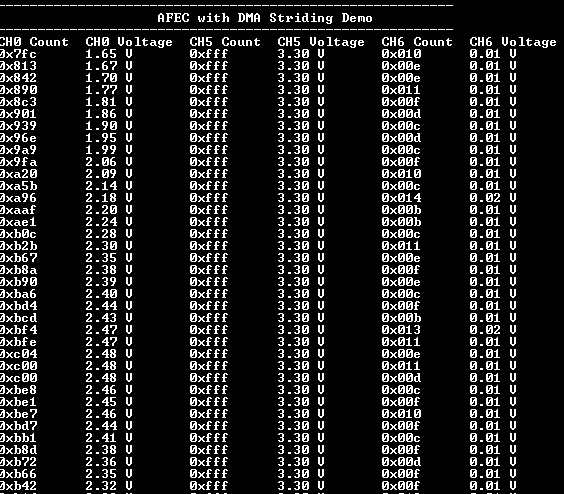

# AFEC with DMA

This example uses AFEC peripheral Library to sample multiple ADC channels using DMA striding.

## Description

This example takes 100 samples of three analog inputs at a 5 KHz sampling rate in triggered conversion mode and then sort the data by an analog channel using XDMAC.

Conversion of the three analog inputs (AD0, AD5, AD6) is triggered by the TC peripheral every 200 us. The ADC results are copied to buffer using DMA. Data striding feature of XDMAC is used to store the ADC results by analog channel number. The console displays the ADC results of all the three channels.

## Downloading and building the application

To download or clone this application from Github, go to the [top level of the repository](https://github.com/Microchip-MPLAB-Harmony/csp_apps_sam_e70_s70_v70_v71) and click

Path of the application within the repository is **apps/afec/afec_dma_striding/firmware** .

To build the application, refer to the following table and open the project using its IDE.

| Project Name      | Description                                    |
| ----------------- | ---------------------------------------------- |
| sam_e70_xult.X    | MPLABX Project for [SAM E70 Xplained Ultra board](https://www.microchip.com/DevelopmentTools/ProductDetails/PartNO/DM320113)|
| sam_v71_xult.X    | MPLABX Project for  [SAM V71 Xplained Ultra board](https://www.microchip.com/developmenttools/ProductDetails/atsamv71-xult)|
|||

## Setting up the hardware

The following table shows the target hardware for the application projects.

| Project Name| Board|
|:---------|:---------:|
|sam_e70_xult.X | [SAM E70 Xplained Ultra board](https://www.microchip.com/DevelopmentTools/ProductDetails/PartNO/DM320113)|
|sam_v71_xult.X | [SAM V71 Xplained Ultra board](https://www.microchip.com/developmenttools/ProductDetails/atsamv71-xult)|
|||

### Setting up [SAM E70 Xplained Ultra board](https://www.microchip.com/DevelopmentTools/ProductDetails/PartNO/DM320113)

- Analog input (AD0) is fed from DAC output. Sine wave output is generated on the DAC output using 100 point lookup table.
  - Analog input "AD0" is mapped to Port Pin "PB1" that is routed to "Pin 14 of the EXT1 header"
  - DAC output "DAC0" is mapped to Port Pin "PB13" that is routed to "Pin 5 of the J502 header"
  - Use jumper wire to Connect "Pin 14 of the EXT1" to "Pin 5 of the J502"
- Analog input (AD5) is connected to Vcc, or the user can supply input from an external source
  - Analog input "AD5" is mapped to Port Pin "PC30" that is routed to "Pin 8 of the EXT1 header"
  - Use a jumper wire to connect "Pin 8 of the EXT1 (AD5)" to Vcc or an external voltage source
- Analog input (AD6) is connected to GND, or the user can supply input from an external source
  - Analog input (AD6) is mapped to Port Pin "PC31" that is routed to "Pin 3 of the EXT1 header"
  - Use a jumper wire to connect "Pin 3 of the EXT1" to GND or an external voltage source
- Connect the Debug USB port on the board to the computer using a micro USB cable

### Setting up [SAM V71 Xplained Ultra board](https://www.microchip.com/developmenttools/ProductDetails/atsamv71-xult)

- Analog input (AD0) is fed from DAC output. Sine wave output is generated on the DAC output using 100 point lookup table.
  - Analog input "AD0" is mapped to Port Pin "PB1" that is routed to "Pin 14 of the EXT1 header"
  - DAC output "DAC0" is mapped to Port Pin "PB13" that is routed to "Pin 5 of the J504 header"
  - Use jumper wire to Connect "Pin 14 of the EXT1" to "Pin 5 of the J504"
- Analog input (AD5) is connected to Vcc, or the user can supply input from an external source
  - Analog input "AD5" is mapped to Port Pin "PC30" that is routed to "Pin 8 of the EXT1 header"
  - Use a jumper wire to connect "Pin 8 of the EXT1 (AD5)" to Vcc or an external voltage source
- Analog input (AD6) is connected to GND, or the user can supply input from an external source
  - Analog input (AD6) is mapped to Port Pin "PC31" that is routed to "Pin 3 of the EXT1 header"
  - Use a jumper wire to connect "Pin 3 of the EXT1" to GND or an external voltage source
- Connect the Debug USB port on the board to the computer using a micro USB cable

## Running the Application

1. Open the Terminal application (Ex.:Tera term) on the computer
2. Connect to the EDBG Virtual COM port and configure the serial settings as follows:
    - Baud : 115200
    - Data : 8 Bits
    - Parity : None
    - Stop : 1 Bit
    - Flow Control : None
3. Build and Program the project using its respective IDE
4. Console displays 100 samples of the ADC count and the respective input voltages for all three channels

