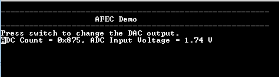

# Analog Front-End Controller polled mode Example (afec_polled_mode)

This example demonstrates how to sample an analog input in polled mode and send the converted data to console.

## Description

In this example, the DAC output is fed to the ADC input. The DAC output is changed by 0.1 V when switch is pressed.
The ADC conversion is triggered by software and converted result is displayed on the console.

## Downloading and building the application

To download or clone this application from Github, go to the [top level of the repository](https://github.com/Microchip-MPLAB-Harmony/csp_apps_sam_e70_s70_v70_v71) and click

Path of the application within the repository is **apps/afec/afec_polled_mode/firmware** .

To build the application, refer to the following table and open the project in their respective IDEs.

| Project Name      | Description                                    |
| ----------------- | ---------------------------------------------- |
| sam_e70_xult.X    | MPLABX Project for [SAM E70 Xplained Ultra board](https://www.microchip.com/DevelopmentTools/ProductDetails/PartNO/DM320113)|
| sam_v71_xult.X    | MPLABX Project for  [SAM V71 Xplained Ultra board](https://www.microchip.com/developmenttools/ProductDetails/atsamv71-xult)|        |

## Setting up the hardware

The following table shows the target hardware for the application projects.

| Project Name| Board|
|:---------|:---------:|
|sam_e70_xult.X||
|sam_v71_xult.X||

### Setting up [SAM E70 Xplained Ultra board](https://www.microchip.com/DevelopmentTools/ProductDetails/PartNO/DM320113)

- An analog input (AD0) is fed from the DAC output. DAC output is incremented by 0.1 V on Switch (SW0) press
- An analog input "AD0" is mapped to Port Pin "PB1" that is routed to "Pin 14 of the EXT1 header"
- The DAC output "DAC0" is mapped to Port Pin "PB13" that is routed to "Pin 5 of the J502 header"
- Use a jumper wire to connect "Pin 14 of the EXT1" to "Pin 5 of the J502"
- Connect the Debug USB port on the board to the computer using a micro USB cable

### Setting up [SAM V71 Xplained Ultra board](https://www.microchip.com/developmenttools/ProductDetails/atsamv71-xult)

- An analog input (AD0) is fed from the DAC output. The DAC output is incremented by 0.1 V on Switch (SW0) press
- An analog input "AD0" is mapped to Port Pin "PB1" that is routed to "Pin 14 of the EXT1 header"
- The DAC output "DAC0" is mapped to Port Pin "PB13" that is routed to "Pin 5 of the J504 header"
- Use a jumper wire to connect "Pin 14 of the EXT1" to "Pin 5 of the J504"
- Connect the Debug USB port on the board to the computer using a micro USB cable

## Running the Application

1. Open the Terminal application (Ex.:Tera term) on the computer
2. Connect to the EDBG Virtual COM port and configure the serial settings as follows:
    - Baud : 115200
    - Data : 8 Bits
    - Parity : None
    - Stop : 1 Bit
    - Flow Control : None
3. Build and Program the application using their respective IDEs
4. The console displays the ADC Count and the ADC Input Voltage
5. Press the switch to change the DAC output by 0.1 V from 0 V to 3.3 V
6. Observe the ADC input value and the respective ADC count value

| Board      | Switch Name                                    |
| ----------------- | ---------------------------------------------- |
| [SAM E70 Xplained Ultra board](https://www.microchip.com/DevelopmentTools/ProductDetails/PartNO/DM320113)    |SW0 |
| [SAM V71 Xplained Ultra board](https://www.microchip.com/developmenttools/ProductDetails/atsamv71-xult)      |SW0 |
