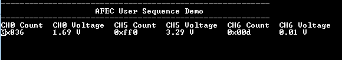

# AFEC user sequence

This example uses AFEC peripheral library to sample three analog inputs using the user sequencer in triggered conversion mode and send the converted data to the console

## Description

Conversion of the three analog inputs is triggered from the TC peripheral every 250 ms. The user sequencer is used to define the order of conversion: AD5, AD6 and AD0. The DAC output is fed to the ADC input AD0. The DAC output is changed by 0.1 V when switch is pressed.
The AD5 is connected to Vcc and the AD6 is connected to GND. Converted digital values are displayed on the console.

## Downloading and building the application

To clone or download this application from Github, go to the [main page of this repository](https://github.com/Microchip-MPLAB-Harmony/csp_apps_sam_e70_s70_v70_v71) and then click **Clone** button to clone this repository or download as zip file.
This content can also be downloaded using content manager by following these [instructions](https://github.com/Microchip-MPLAB-Harmony/contentmanager/wiki).

Path of the application within the repository is **apps/afec/afec_jser_sequence/firmware** .

To build the application, refer to the following table and open the project using its IDE.

| Project Name      | Description                                    |
| ----------------- | ---------------------------------------------- |
| sam_e70_xult.X    | MPLABX Project for [SAM E70 Xplained Ultra board](https://www.microchip.com/DevelopmentTools/ProductDetails/PartNO/DM320113)|
| sam_v71_xult.X    | MPLABX Project for  [SAM V71 Xplained Ultra board](https://www.microchip.com/developmenttools/ProductDetails/atsamv71-xult)|
|||

## Setting up the hardware

The following table shows the target hardware for the application projects.

| Project Name| Board|
|:---------|:---------:|
|sam_e70_xult.X | [SAM E70 Xplained Ultra board](https://www.microchip.com/DevelopmentTools/ProductDetails/PartNO/DM320113)|
|sam_v71_xult.X | [SAM V71 Xplained Ultra board](https://www.microchip.com/developmenttools/ProductDetails/atsamv71-xult)|
|||

### Setting up [SAM E70 Xplained Ultra board](https://www.microchip.com/DevelopmentTools/ProductDetails/PartNO/DM320113)

- Analog input (AD0) is fed from the DAC output. The DAC output is incremented by 0.1 V on switch press
  - Analog input "AD0" is mapped to Port Pin "PB1" that is routed to "Pin 14 of the EXT1 header"
  - DAC output "DAC0" is mapped to Port Pin "PB13" that is routed to "Pin 5 of the J502 header"
  - Use a jumper wire to Connect "Pin 14 of the EXT1" to "Pin 5 of the J502"
- Analog input (AD5) is connected to Vcc, or the user can supply input from an external source
  - Analog input "AD5" is mapped to Port Pin "PC30" that is routed to "Pin 8 of the EXT1 header"
  - Use a jumper wire to connect "Pin 8 of the EXT1 (AD5)" to Vcc or an external voltage source
- Analog input (AD6) is connected to GND, or the user can supply input from an external source
  - Analog input (AD6) is mapped to Port Pin "PC31" that is routed to "Pin 3 of the EXT1 header"
  - Use a jumper wire to connect "Pin 3 of the EXT1" to GND or an external voltage source
- Connect the Debug USB port on the board to the computer using a micro USB cable

### Setting up [SAM V71 Xplained Ultra board](https://www.microchip.com/developmenttools/ProductDetails/atsamv71-xult)

- Analog input (AD0) is fed from the DAC output. The DAC output is incremented by 0.1 V on switch press
  - Analog input "AD0" is mapped to Port Pin "PB1" that is routed to "Pin 14 of the EXT1 header"
  - DAC output "DAC0" is mapped to Port Pin "PB13" that is routed to "Pin 5 of the J504 header"
  - Use a jumper wire to Connect "Pin 14 of the EXT1" to "Pin 5 of the J504"
- Analog input (AD5) is connected to Vcc, or the user can supply input from an external source
  - Analog input "AD5" is mapped to Port Pin "PC30" that is routed to "Pin 8 of the EXT1 header"
  - Use a jumper wire to connect "Pin 8 of the EXT1 (AD5)" to Vcc or an external voltage source
  - Analog input (AD6) is connected to GND, or the user can supply input from an external source
- Analog input (AD6) is mapped to Port Pin "PC31" that is routed to "Pin 3 of the EXT1 header"
  - Use a jumper wire to connect "Pin 3 of the EXT1" to GND or an external voltage source
- Connect the Debug USB port on the board to the computer using a micro USB cable

## Running the Application

1. Open the Terminal application (Ex.:Tera term) on the computer
2. Connect to the EDBG Virtual COM port and configure the serial settings as follows:
    - Baud : 115200
    - Data : 8 Bits
    - Parity : None
    - Stop : 1 Bit
    - Flow Control : None
3. Build and Program the application using its respective IDE
4. Console displays the ADC count and the respective input voltages for all three channels

    

5. Press the switch to change the DAC output by 0.1 V from 0 V to 3.3 V
6. DAC output is connected to CH0. Observe the ADC count and the respective input voltage.

| Board      | Switch Name                                    |
| ----------------- | ---------------------------------------------- |
| [SAM E70 Xplained Ultra board](https://www.microchip.com/DevelopmentTools/ProductDetails/PartNO/DM320113)    |SW0 |
| [SAM V71 Xplained Ultra board](https://www.microchip.com/developmenttools/ProductDetails/atsamv71-xult)      |SW0 |
|||
