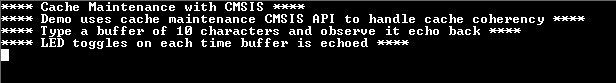

# Cache maintenance

This example shows cache maintenance operation by cleaning and invalidating the cache for the DMA buffers located in the cacheable SRAM region.

## Description

This example application shows how to use the cache maintenance APIs to avoid issues related to cache coherency when the data cache is enabled. Application uses USART and the DMA PLIBs to demonstrate cache maintenance APIs provided by the Cache peripheral library.

Applcation registers a callback with the DMA transmit and receive channels. It then transmits a message using the DMA transmit channel and then schedules a read of ten characters using the DMA receive channel. Once the DMA readis complete, it reads the received data and echoes the same on the terminal using the DMA transmit channel.

Application calls DCACHE_CLEAN_BY_ADDR API on the write buffer before transmitting it. Calling this API copies the data from the cache memory to the main memory, thereby ensuring that the DMA peripheral uses the updated values in the write buffer.

Application calls the DCACHE_INVALIDATE_BY_ADDR API on the read buffer after reception of data is complete by the DMA receive channel. Calling this API invalidates the cache region corresponding to the read buffer, thereby ensuring that the CPU reads updated values in the main memory into the read buffer (and into the cache memory).

Cache maintenance operations are always performed on a cache line (1 cache line = 32 bytes), thus the read and write buffers must be aligned to a 32 byte boundary and must be a multiple of 32 bytes. This is the reason why 32 byte buffers are used for receiving and echoing 10 bytes of data.

## Downloading and building the application

To download or clone this application from Github, go to the [top level of the repository](https://github.com/Microchip-MPLAB-Harmony/csp_apps_sam_e70_s70_v70_v71) and click

Path of the application within the repository is **apps/cache/cache_maintenance/firmware** .

To build the application, refer to the following table and open the project using its IDE.

| Project Name      | Description                                    |
| ----------------- | ---------------------------------------------- |
| sam_e70_xult.X    | MPLABX Project for [SAM E70 Xplained Ultra board](https://www.microchip.com/DevelopmentTools/ProductDetails/PartNO/DM320113)|
| sam_v71_xult.X    | MPLABX Project for  [SAM V71 Xplained Ultra board](https://www.microchip.com/developmenttools/ProductDetails/atsamv71-xult)|
|||

## Setting up the hardware

The following table shows the target hardware for the application projects.

| Project Name| Board|
|:---------|:---------:|
|sam_e70_xult.X | [SAM E70 Xplained Ultra board](https://www.microchip.com/DevelopmentTools/ProductDetails/PartNO/DM320113)|
|sam_v71_xult.X | [SAM V71 Xplained Ultra board](https://www.microchip.com/developmenttools/ProductDetails/atsamv71-xult)|
|||

### Setting up [SAM E70 Xplained Ultra board](https://www.microchip.com/DevelopmentTools/ProductDetails/PartNO/DM320113)

- Connect the Debug USB port on the board to the computer using a micro USB cable

### Setting up [SAM V71 Xplained Ultra board](https://www.microchip.com/developmenttools/ProductDetails/atsamv71-xult)

- Connect the Debug USB port on the board to the computer using a micro USB cable

## Running the Application

1. Open the Terminal application (Ex.:Tera term) on the computer
2. Connect to the EDBG Virtual COM port and configure the serial settings as follows:
    - Baud : 115200
    - Data : 8 Bits
    - Parity : None
    - Stop : 1 Bit
    - Flow Control : None
3. Build and Program the application using its respective IDE
4. The console displays the following message
    
5. Type 10 characters in the terminal. It will echo back the received bytes and toggles the LED
6. The following table provides the LED names

| Board      | LED Name                                    |
| ----------------- | ---------------------------------------------- |
| [SAM E70 Xplained Ultra board](https://www.microchip.com/DevelopmentTools/ProductDetails/PartNO/DM320113)    |LED1 |
| [SAM V71 Xplained Ultra board](https://www.microchip.com/developmenttools/ProductDetails/atsamv71-xult)      |LED0 |
|||
