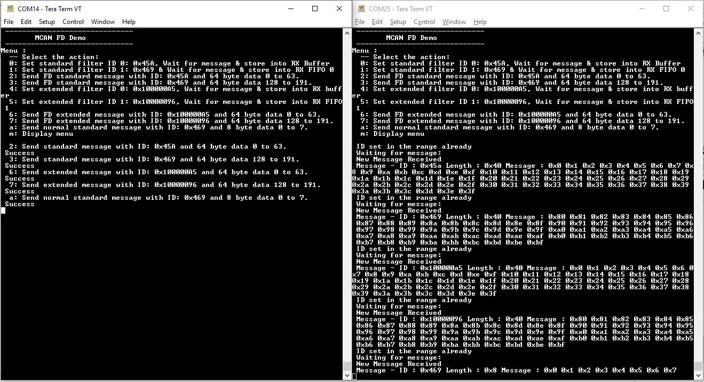

# MCAN FD blocking

This example shows how to use the MCAN module to transmit and receive CAN FD messages in polling mode.

## Description

This application transmits and receives CAN FD messages on the CAN bus. To run this application, two evaluation boards of same type are required. These boards acts as different nodes on the CAN bus. Same application is programmed onto both the boards. Boards are connected to PC via UART. While running the application, user can send and receive CAN FD messages between the boards using UART console applications running on the PC.

### MCAN Message RAM configuration
- Allocate MCAN Message RAM configuration in contiguous non-cacheable buffer in the application.
  For example, uint8_t Mcan1MessageRAM[MCAN1_MESSAGE_RAM_CONFIG_SIZE] __attribute__((aligned (32)))__attribute__((space(data), section (".ram_nocache"))); 

- Add non-cacheable section "ram_nocache" in the Custom linker script

| Project Name      | Description                                    |
| ----------------- | ---------------------------------------------- |
| sam_e70_xult.X    | Custom linker script **apps/mcan/mcan_fd_operation_blocking/firmware/src/config/sam_e70_xult/ATSAME70Q21B.ld** |
| sam_v71_xult.X    | Custom linker script **apps/mcan/mcan_fd_operation_blocking/firmware/src/config/sam_v71_xult/ATSAMV71Q21B.ld** |
|||

- Please refer [How to Create Non-Cacheable Memory Region on CortexM7 (SAM S70/ E70/ V70/ V71) MCUs Using MPLAB Harmony
v3](http://ww1.microchip.com/downloads/en/DeviceDoc/How_to_Create_Non-Cacheabl_%20Memory_Region_on_Cortex-M7_(SAME70)_MCU_Using_MPLAB_Harmonyv3_DS90003260A.pdf) to create a non-cacheable memory region.

## Downloading and building the application

To clone or download this application from Github, go to the [main page of this repository](https://github.com/Microchip-MPLAB-Harmony/csp_apps_sam_e70_s70_v70_v71) and then click **Clone** button to clone this repository or download as zip file.
This content can also be downloaded using content manager by following these [instructions](https://github.com/Microchip-MPLAB-Harmony/contentmanager/wiki).

Path of the application within the repository is **apps/mcan/mcan_fd_operation_blocking/firmware** .

To build the application, refer to the following table and open the project using its IDE.

| Project Name      | Description                                    |
| ----------------- | ---------------------------------------------- |
| sam_e70_xult.X    | MPLABX Project for [SAM E70 Xplained Ultra board](https://www.microchip.com/DevelopmentTools/ProductDetails/PartNO/DM320113)|
| sam_v71_xult.X    | MPLABX Project for  [SAM V71 Xplained Ultra board](https://www.microchip.com/developmenttools/ProductDetails/atsamv71-xult)|
|||

## Setting up the hardware

The following table shows the target hardware for the application projects.

| Project Name| Board|
|:---------|:---------:|
|sam_e70_xult.X | [SAM E70 Xplained Ultra board](https://www.microchip.com/DevelopmentTools/ProductDetails/PartNO/DM320113)|
|sam_v71_xult.X | [SAM V71 Xplained Ultra board](https://www.microchip.com/developmenttools/ProductDetails/atsamv71-xult)|
|||

### Setting up [SAM E70 Xplained Ultra board](https://www.microchip.com/DevelopmentTools/ProductDetails/PartNO/DM320113)

- Connect SAM E70 Xplained Ultra board to another SAM E70 Xplained Ultra board as per the pin connections shown below

| SAME70 XULT - 1   | SAME70 XULT - 2    |
| ----------------- | ------------------ |
| CAN_H             | CAN_H              |
| CAN_L             | CAN_L              |
| GND               | GND                |
|||

- Connect the Debug USB port on the board to the computer using a micro USB cable

### Setting up [SAM V71 Xplained Ultra board](https://www.microchip.com/developmenttools/ProductDetails/atsamv71-xult)

- Connect SAM V71 Xplained Ultra board to another SAM V71 Xplained Ultra board as per the pin connections shown below

| SAMV71 XULT - 1   | SAMV71 XULT - 2    |
| ----------------- | ------------------ |
| CAN_H             | CAN_H              |
| CAN_L             | CAN_L              |
| GND, EXT1 PIN19   | GND, EXT1 PIN19    |
|||

- Connect the Debug USB port on the board to the computer using a micro USB cable

## Running the Application

1. Open the Terminal application (Ex.:Tera term) on the computer
2. Connect to the EDBG Virtual COM port of both the boards and configure the serial settings as follows:
    - Baud : 115200
    - Data : 8 Bits
    - Parity : None
    - Stop : 1 Bit
    - Flow Control : None
3. Build and Program the application on both the boards using their respective IDEs
4. In the console associated with board 1, press "0" to transmit a CAN FD message
5. Transmitted message description and status will be displayed in the console window of board 1
6. Received message will be displayed in the console window of board 2
7. Follow the sequence below to send and receive different messages:
    - Press '1' on board 1
    - Press '2' on board 1
    - Press '3' on board 1
    - Press '4' on board 1
    - Press '0' on board 2
    - Press '1' on board 2
    - Press '2' on board 2
    - Press '3' on board 2
    - Press '4' on board 2
8. If the steps are executed in this sequence, the final output in the consoles will be as below (console on the left is the transmitter (board 1) and the one on the right is receiver (board 2)):

  
