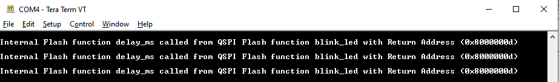
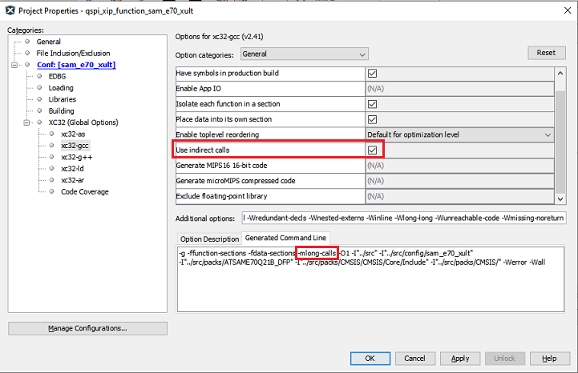

# QSPI flash XIP Function

This example shows how to setup the QSPI Flash in the XIP mode to call a function placed in QSPI Flash memory.

## Description

The QSPI execute in place (XIP) feature allows the system to execute code directly from a serial Flash memory without code shadowing to RAM. The serial Flash memory appears as memory-mapped device in QSPI region. As Quad SPI mode uses four lines for data transfer, it allows the system to use high-performance serial Flash memories which are small and inexpensive, in place of larger and more expensive parallel Flash memories.

The application defines a **blink_led()** function to run from QSPI Flash memory using the special section **".code_in_qspi"** defined in the custom linker script for the project.

Any Function which is defined in the **".code_in_qspi"** section will be **loaded** into the Internal Flash memory and when **called** will run from QSPI flash memory.

The application execution sequence is given below:

- Program the **blink_led()** function into QSPI Flash memory
- Enable **Continuous Read Mode** to enter into XIP mode
- Verify if **blink_led()** function is programmed by reading back from QSPI Memory location and comparing it
- If verification passes, it calls the **blink_led()** function to run from QSPI Flash memory region
- **blink_led()** function
    - Calls function **delay_ms()** which is defined in internal flash memory and then toggles an LED
- **delay_ms()** function
    - Causes a delay of 1 second
    - prints a message which has **called function, caller function and caller functions return address** on UART console

## Downloading and building the application

To clone or download this application from Github, go to the [main page of this repository](https://github.com/Microchip-MPLAB-Harmony/csp_apps_sam_e70_s70_v70_v71) and then click **Clone** button to clone this repository or download as zip file.
This content can also be downloaded using content manager by following these [instructions](https://github.com/Microchip-MPLAB-Harmony/contentmanager/wiki).

Path of the application within the repository is **apps/qspi/qspi_xip_function/** .

To build the application, refer to the following table and open the project using its IDE.

| Project Name      | Description                                    |
| ----------------- | ---------------------------------------------- |
| sam_e70_xult.X    | MPLABX Project for [SAM E70 Xplained Ultra board](https://www.microchip.com/DevelopmentTools/ProductDetails/PartNO/DM320113)|
|||

## Setting up the hardware

The following table shows the target hardware for the application projects.

| Project Name| Board|
|:---------|:---------:|
|sam_e70_xult.X | [SAM E70 Xplained Ultra board](https://www.microchip.com/DevelopmentTools/ProductDetails/PartNO/DM320113)|
|||

### Setting up [SAM E70 Xplained Ultra board](https://www.microchip.com/DevelopmentTools/ProductDetails/PartNO/DM320113)

- Connect the Debug USB port on the board to the computer using a micro USB cable

## Running the Application

1. Open the Terminal application (Ex.:Tera term) on the computer
2. Connect to the EDBG Virtual COM port and configure the serial settings as follows:
    - Baud : 115200
    - Data : 8 Bits
    - Parity : None
    - Stop : 1 Bit
    - Flow Control : None
3. Build and Program the application using its IDE

4. LED indicates success or failure:
    - The LED is toggled when the **blink_led** function is successfully programmed, verified and called
    - The LED is turned ON for any failures during the programming or verification

5. The console displays the following message on Success
    - **Note:** Observe the called function, caller function and the return address of the caller function which is in QSPI Flash Memory region.

    

The following table provides the LED name

| Board      | LED name |
| ----------------- | ---------------------------------------------- |
| [SAM E70 Xplained Ultra board](https://www.microchip.com/DevelopmentTools/ProductDetails/PartNO/DM320113)    | LED1 |
|||

## Additonal Information

- If a function placed in QSPI memory region needs to call any function in Internal Flash region then that function has to be defined with attribute **long_call**
    - In above example **delay_ms()** function was defined as wrapper function to call SYSTICK PLIB and printf functions

- To avoid defining wrappers like this or having each function in internal flash defined with **long_call** attribute, below option from MPLABX IDE can be used to mark all the function of the firmware as **long_call**
    - **Note: Enabling this option will increase the size of the firmware**

    
