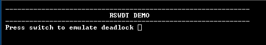
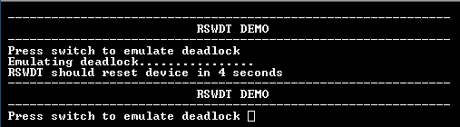

# RSWDT timeout

This example shows how to generate a RSWDT reset by emulating a deadlock.

## Description

This example demonstrates the usage of Reinforced Safety Watchdog Timer to avoid system deadlock. The simplest way to emulate a deadlock is to wait in an infinite loop. The application enters such an infinite loop when the switch is pressed. As a result
the RSWDT counter is not cleared within a bounded time configured using MHC. The RSWDT peripheral will trigger a system reset as the counter exceeds the specified time band.

## Downloading and building the application

To download or clone this application from Github, go to the [top level of the repository](https://github.com/Microchip-MPLAB-Harmony/csp_apps_sam_e70_s70_v70_v71) and click

Path of the application within the repository is **apps/rswdt/rswdt_timeout/firmware** .

To build the application, refer to the following table and open the project using its IDE.

| Project Name      | Description                                    |
| ----------------- | ---------------------------------------------- |
| sam_e70_xult.X    | MPLABX Project for [SAM E70 Xplained Ultra board](https://www.microchip.com/DevelopmentTools/ProductDetails/PartNO/DM320113)|
| sam_v71_xult.X    | MPLABX Project for  [SAM V71 Xplained Ultra board](https://www.microchip.com/developmenttools/ProductDetails/atsamv71-xult)|
|||

## Setting up the hardware

The following table shows the target hardware for the application projects.

| Project Name| Board|
|:---------|:---------:|
|sam_e70_xult.X | [SAM E70 Xplained Ultra board](https://www.microchip.com/DevelopmentTools/ProductDetails/PartNO/DM320113)|
|sam_v71_xult.X | [SAM V71 Xplained Ultra board](https://www.microchip.com/developmenttools/ProductDetails/atsamv71-xult)|
|||

### Setting up [SAM E70 Xplained Ultra board](https://www.microchip.com/DevelopmentTools/ProductDetails/PartNO/DM320113)

- Connect the Debug USB port on the board to the computer using a micro USB cable

### Setting up [SAM V71 Xplained Ultra board](https://www.microchip.com/developmenttools/ProductDetails/atsamv71-xult)

- Connect the Debug USB port on the board to the computer using a micro USB cable

## Running the Application

1. Open the Terminal application (Ex.:Tera term) on the computer
2. Connect to the EDBG Virtual COM port and configure the serial settings as follows:
    - Baud : 115200
    - Data : 8 Bits
    - Parity : None
    - Stop : 1 Bit
    - Flow Control : None
3. Build and Program the application project using its IDE
4. The console displays the following message

    

5. Press the switch to put the system in a deadlock
6. LED should stop blinking and the console should print the following message

    

7. RSWDT will reset the device in four seconds and the demonstration should restart

The following table provides the LED and switch names

| Board | LED  | Switch  |
| ----- | --------- | ------------ |
| [SAM E70 Xplained Ultra board](https://www.microchip.com/DevelopmentTools/ProductDetails/PartNO/DM320113)    |LED1 | SW0 |
| [SAM V71 Xplained Ultra board](https://www.microchip.com/developmenttools/ProductDetails/atsamv71-xult)      |LED0 | SW0 |
|||
