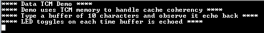

# TCM cache coherency

This example shows how to  maintain cache coherency by allocating the DMA buffers in the Tightly Coupled Memory (TCM), which are not cacheable.

## Description

This example application shows how to use the data TCM to ensure a high-speed, low latency, and deterministic access to data.TCM is a memory accessed by a dedicated connection from the core. Access to the TCM memory is at full processor clock speed and can be accessed both by the CPU and the DMA. TCM provides deterministic behavior as it does not suffer from
cache hit and cache miss. There is no explicit or extra memory for TCM. It is the internal SRAM of the microcontroller that gets partitioned as TCM + SRAM.

This application uses the USART and the DMA PLIBs to demonstrate the TCM usage. It registers a callback with the DMA transmit and receive channels. Application first transmits a message using DMA transmit channel and then schedules a read of ten characters using the DMA receive channel. Once the DMA read is complete, it reads the received data and echoes the same on the terminal using the DMA transmit channel.

Unlike the cache maintenance APIs, using the TCM does not pose restrictions on aligning the read and write buffers to a 32-byte boundary with a size that is a multiple of 32 bytes. An XC32 compiler attribute can be used to place the read and write buffers into the TCM memory region to avoid the issues related to cache coherency when the DMA is used with the data cache enabled.

## Downloading and building the application

To download or clone this application from Github, go to the [top level of the repository](https://github.com/Microchip-MPLAB-Harmony/csp_apps_sam_e70_s70_v70_v71) and click

Path of the application within the repository is **apps/tcm/data_tcm/firmware** .

To build the application, refer to the following table and open the project using its IDE.

| Project Name      | Description                                    |
| ----------------- | ---------------------------------------------- |
| sam_e70_xult.X    | MPLABX Project for [SAM E70 Xplained Ultra board](https://www.microchip.com/DevelopmentTools/ProductDetails/PartNO/DM320113)|
| sam_v71_xult.X    | MPLABX Project for  [SAM V71 Xplained Ultra board](https://www.microchip.com/developmenttools/ProductDetails/atsamv71-xult)|
|||

## Setting up the hardware

The following table shows the target hardware for the application projects.

| Project Name| Board|
|:---------|:---------:|
|sam_e70_xult.X | [SAM E70 Xplained Ultra board](https://www.microchip.com/DevelopmentTools/ProductDetails/PartNO/DM320113)|
|sam_v71_xult.X | [SAM V71 Xplained Ultra board](https://www.microchip.com/developmenttools/ProductDetails/atsamv71-xult)|
|||

### Setting up [SAM E70 Xplained Ultra board](https://www.microchip.com/DevelopmentTools/ProductDetails/PartNO/DM320113)

- Connect the Debug USB port on the board to the computer using a micro USB cable

### Setting up [SAM V71 Xplained Ultra board](https://www.microchip.com/developmenttools/ProductDetails/atsamv71-xult)

- Connect the Debug USB port on the board to the computer using a micro USB cable

## Running the Application

1. Open the Terminal application (Ex.:Tera term) on the computer
2. Connect to the EDBG Virtual COM port and configure the serial settings as follows:
    - Baud : 115200
    - Data : 8 Bits
    - Parity : None
    - Stop : 1 Bit
    - Flow Control : None
3. Build and Program the application using its IDE
4. The console displays the following message

    

5. Type 10 characters in the terminal. It will echo back the received bytes and toggles the LED
6. The following table provides the LED names

| Board      | LED Name                                    |
| ----------------- | ---------------------------------------------- |
| [SAM E70 Xplained Ultra board](https://www.microchip.com/DevelopmentTools/ProductDetails/PartNO/DM320113)    |LED1 |
| [SAM V71 Xplained Ultra board](https://www.microchip.com/developmenttools/ProductDetails/atsamv71-xult)      |LED0 |
|||
