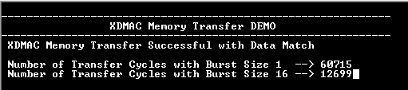

# XDMAC memory transfer

This example shows how to use the XDMAC peripheral to do a memory to memory transfer and illustrates the usage of burst size to reduce the transfer time.

## Description

The application uses the XDMAC peripheral to transfer data from source buffer to destination buffer with burst sizes of 1 and 16. The number of cycles taken for the transfer is measured using the System timer/Periodic Interval Timer (SysTick/PIT) to illustrate how the burst size helps to reduces the transfer time.

This example also demonstrates cache maintenance operation by cleaning and invalidating cache for the buffers located in cacheable memory. The buffers are aligned to cache line and its size is an integer multiple of the cache line size. Cache line(s) for source buffer range is cleaned before submitting a transfer request to DMA to load the latest data in the cache to the RAM (SRAM/DDR). Cache line(s) for destination buffer address range is invalidated to ensure that the CPU reads the latest data from the RAM (SRAM/DDR).

## Downloading and building the application

To clone or download this application from Github, go to the [main page of this repository](https://github.com/Microchip-MPLAB-Harmony/csp_apps_sam_e70_s70_v70_v71) and then click **Clone** button to clone this repository or download as zip file.
This content can also be downloaded using content manager by following these [instructions](https://github.com/Microchip-MPLAB-Harmony/contentmanager/wiki).

Path of the application within the repository is **apps/xdmac/xdmac_memory_transfer/firmware** .

To build the application, refer to the following table and open the project using its IDE.

| Project Name      | Description                                    |
| ----------------- | ---------------------------------------------- |
| sam_e70_xult.X    | MPLABX Project for [SAM E70 Xplained Ultra board](https://www.microchip.com/DevelopmentTools/ProductDetails/PartNO/DM320113)|
| sam_v71_xult.X    | MPLABX Project for  [SAM V71 Xplained Ultra board](https://www.microchip.com/developmenttools/ProductDetails/atsamv71-xult)|
|||

## Setting up the hardware

The following table shows the target hardware for the application projects.

| Project Name| Board|
|:---------|:---------:|
|sam_e70_xult.X | [SAM E70 Xplained Ultra board](https://www.microchip.com/DevelopmentTools/ProductDetails/PartNO/DM320113)|
|sam_v71_xult.X | [SAM V71 Xplained Ultra board](https://www.microchip.com/developmenttools/ProductDetails/atsamv71-xult)|
|||

### Setting up [SAM E70 Xplained Ultra board](https://www.microchip.com/DevelopmentTools/ProductDetails/PartNO/DM320113)

- Connect the Debug USB port on the board to the computer using a micro USB cable

### Setting up [SAM V71 Xplained Ultra board](https://www.microchip.com/developmenttools/ProductDetails/atsamv71-xult)

- Connect the Debug USB port on the board to the computer using a micro USB cable

## Running the Application

1. Open the Terminal application (Ex.:Tera term) on the computer
2. Connect to the EDBG Virtual COM port and configure the serial settings as follows:
    - Baud : 115200
    - Data : 8 Bits
    - Parity : None
    - Stop : 1 Bit
    - Flow Control : None
3. Build and Program the application using its respective IDE
4. See the following message in the console

    

    - Console displays the cycles taken to transfer 10016 bytes with a burst size of 1 and 16
    - *Note: Transfer cycles values are approximates and will vary due to measurement error*
